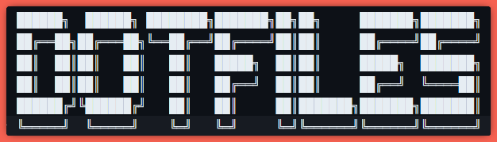
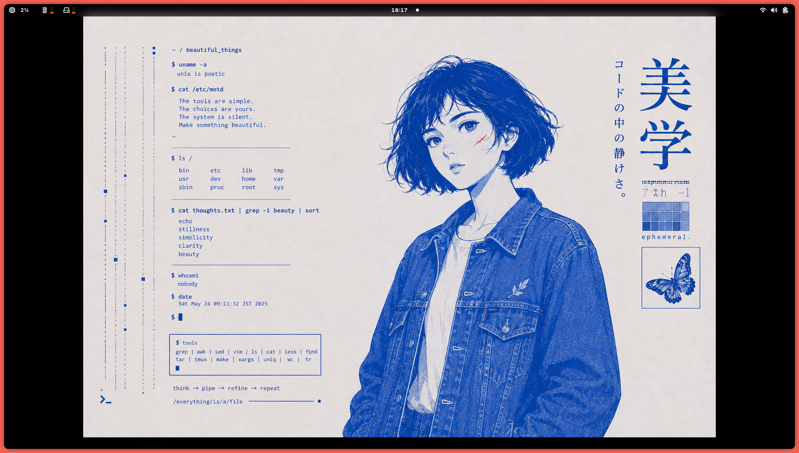

<div align="center">
  
  <p>
    This repository is the working surface behind my daily machine setup:
    a curated editor, reproducible tooling, opinionated defaults, and a bootstrap flow
    that keeps new environments fast to assemble.
  </p>
  <p>
    <a href="#stack">Stack</a> ·
    <a href="#workflow">Workflow</a> ·
    <a href="#managed-surface">Managed Surface</a> ·
    <a href="#bootstrap">Bootstrap</a>
  </p>
</div>

---

<div align="center">
  
</div>

## Stack

<table>
  <tr>
    <td valign="top" width="33%">
      <strong>Bash + Starship</strong><br />
      A simple shell baseline with a prompt that adds structure without adding noise.
    </td>
    <td valign="top" width="33%">
      <strong>Zed</strong><br />
      The primary editor, tuned for a cleaner UI, light theme bias, and built-in AI tooling.
    </td>
    <td valign="top" width="33%">
      <strong>Mise</strong>
      <br />
      The runtime and tool manager that keeps core CLI dependencies reproducible across machines.
    </td>
  </tr>
  <tr>
    <td valign="top" width="33%">
      <strong>Bootstrap Scripts</strong><br />
      A small script chain for linking config, preparing tools, and bringing new machines up quickly.
    </td>
    <td valign="top" width="33%">
      <strong>Agent Tooling</strong><br />
      Codex and Claude Code setup, shared rules, and bootstrap automation for agent-assisted work.
    </td>
    <td valign="top" width="33%"></td>
  </tr>
</table>

## Workflow

This setup is optimized for a machine that should feel ready quickly and stay readable all day.

- Light, quiet editor defaults over dense or flashy UI.
- Reproducible tools managed through `mise` instead of one-off installs.
- Declarative machine bootstrap through `mise`: system packages, dotfile links, and repo checkouts.
- Agent-friendly local development with shared rules and editor integration already wired in.

## Managed Surface

This repository focuses on a small, intentional surface area rather than trying to own every part of the machine.

- `mise.toml` is the repository bootstrap entry point; install `mise` separately, then select a machine profile.
- Selected config is symlinked into place for `Zed` and `starship` from `[dotfiles]`.
- Agent configuration is linked into `.agents`, `.claude`, and `.codex` with shared rules for local coding tools.
- `[bootstrap.packages]` covers dnf and Flatpak on Fedora and Homebrew on macOS; `[bootstrap.macos.defaults]` covers macOS preferences.

## Bootstrap

Install `mise` first:

```bash
curl https://mise.run | sh
```

Then run the profile for the current machine from the cloned repository:

```bash
mise trust
mise -E personal bootstrap
```

`personal` currently preserves the existing Fedora desktop setup. `raspberry` and `server` are intentionally empty starting points, so their packages, services, and dotfiles can be added without inheriting desktop setup. Files under [`personal/`](personal/) mirror their paths under `~` for the `personal` profile. The repository no longer installs a global mise configuration, so select the profile with `-E` whenever a mise command needs its tools or configuration.

For the Raspberry Pi, run `mise -E raspberry bootstrap`. This installs Docker and Nanobot, then starts Forgejo from [`raspberry/forgejo/compose.yml`](raspberry/forgejo/compose.yml). 1Panel and its app data remain independently managed.

Use `mise -E <profile> bootstrap --dry-run` to preview changes and `mise -E <profile> bootstrap plan` to report declarative drift.

Run `mise -E personal bootstrap --update` to fast-forward the repositories declared by the personal profile.
